# Competition-Management-App

## **Prezentare generală**
Proiectul de față propune implementarea unei aplicații web pentru realizarea managementului competițiilor de karate. Sistemul conține o bază de date în care sunt stocate datele despre competiții, utilizatori și sportivi. Funcționalitățile aplicației vor fi structurate într-o interfata grafică. Pentru implementarea proiectului se va folosi limbajul Java alături de framework-ul Spring Boot.
## **Soluția propusă**
## 1) Spring Boot
Alături de Java se va folosi și framework-ul Spring Boot, deoarece permite autoconfigurarea pe baza dependințelor, nu necesită configurare XML și oferă POM-uri pentru simplificarea configurației Maven. Astfel, în fișierul *pom.xml* se găsesc dependințe pentru teste(JUnit), conectarea cu baza de date(MySQL Connector) și plugin-ul de Maven.
## 2) Baza de date
Pentru crearea, dezvoltrea și administrarea bazei de date se va utiliza MySQL Workbench care este un mediu de dezvoltare pentru bazele de date de implementate în MySQL.
## Cerințe de sistem
### Actori
| Actor         | Tip       | Descriere         |
|:-------------:|:---------:|:-----------------:|
| Administrator         | Uman      | Persoana care se ocupuda de menenanța sistemului și a bazei de date. |
| Manager de competitii     | Uman      |Persoana care crează/editează/șterge competițiile. |
| Antrenorul      | Uman      | Persoana care înscrie/retrage sportivi din/în competiții |
|Vizitatorul   | Uman      | Persoana care nu are cont. |
### Descriere tipuri de actori
#### *Descriere administrator*
Administratorul va fi cel care va realiza întreaga mentenanță a sistemului. El va avea drepturi depline în adăugarea de noi utilizatori sau eliminarea utilizatorilor deja existenți. De asemenea, administratorul va putea trimite mesaje tuturor utilizatorilor, putând chiar să acorde sau retragă privilegiile acestora. El va fi responsabil de reactualizarea paginii web și de administrarea corectă a bazei de date a sistemului. Administratorul se va conecta la sistem printr-un user și o parolă unică. 
#### *Descriere manager de competiții*
Managerul de competiții este un utilizatorul autorizat sa creeze/editeze/șteargă o competiție și să monitorizeze procesul de înscriere și derulare al competițiilor.
#### *Descriere antrenor*
Antrenorul este un utilizatorul autorizat să creeze un club virtual, să adauge/șteargă/editeze sportivi și sa înscrie sportivi în competiții.
#### *Descriere vizitator*
Vizitatorul, adica utilizator temporar,  va avea dreptul de a vizualiza doar rezultatele competițiilor și clasamentele sportivilor. Acesta poate deveni utilizator autorizat prin înregistrarea în contul paginii printr-un cod de acces.
### Listă de funcționalități
-	Login/ Logout utilizatori
-	Creare/ editare/ stergere cont utilizator
-	Căutare competiție
-	Vizualizare informații despre competiție
-	Înscriere sportiv în “club virtual”
-	Creare/ editare/ ștergere competiție
-	Înscriere sportivi în competiție
-	Vizualizare clasamente
-	Actualizare/vizualizare rezulate competiție
## **Descrierea soluției**
### Diagramele sistemului
### Diagrame use case
#### *Use case Administrator*
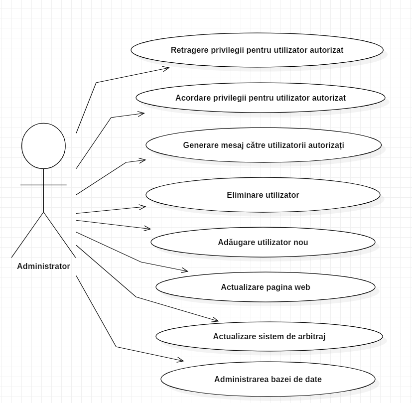
#### *Use case Antrenor*
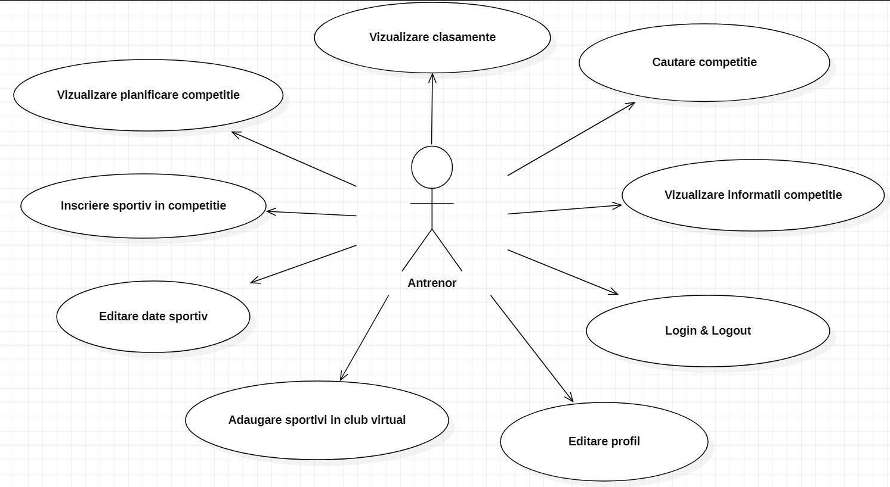
#### *Use case Manager competiții*
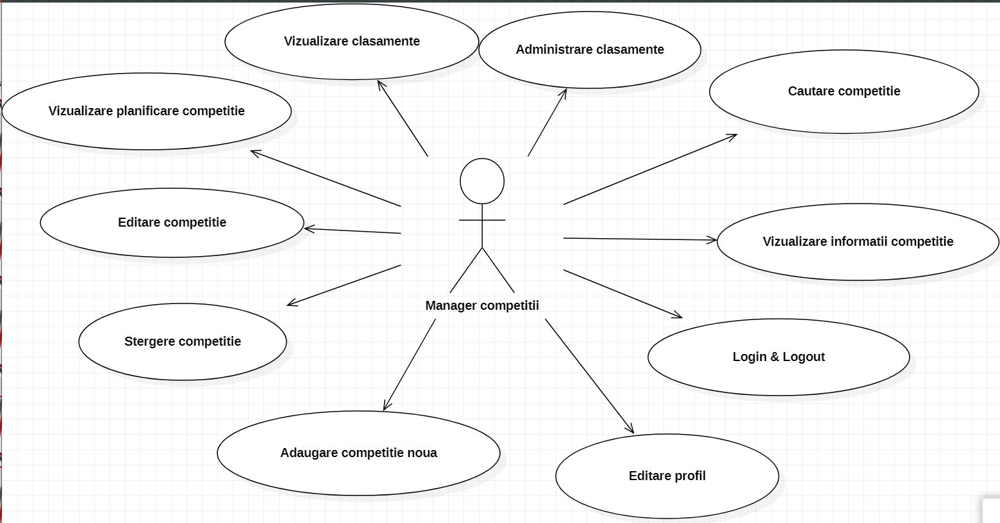
#### *Use case Vizitator*
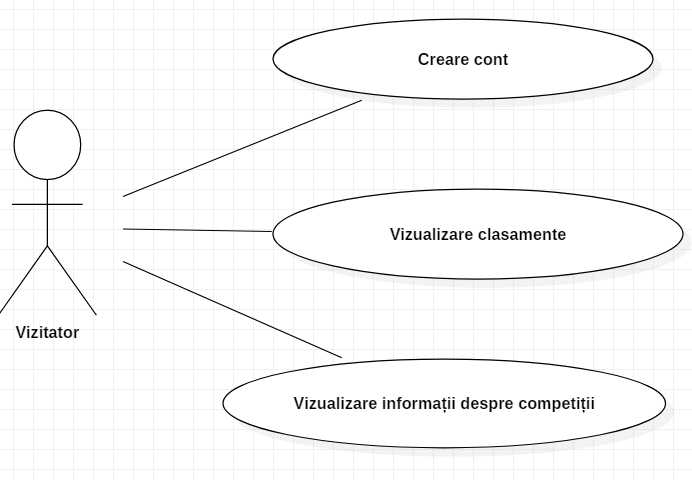
### **Diagrama principală a arhitecturii**
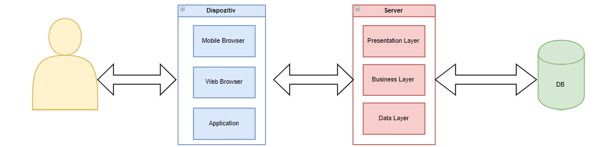
### **Diagrama de deployment**
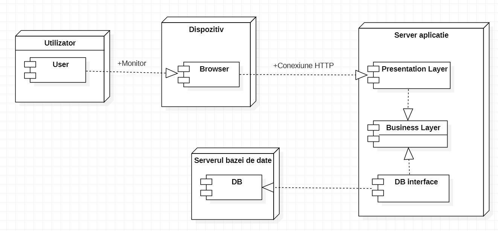
### **Diagrama de clase**
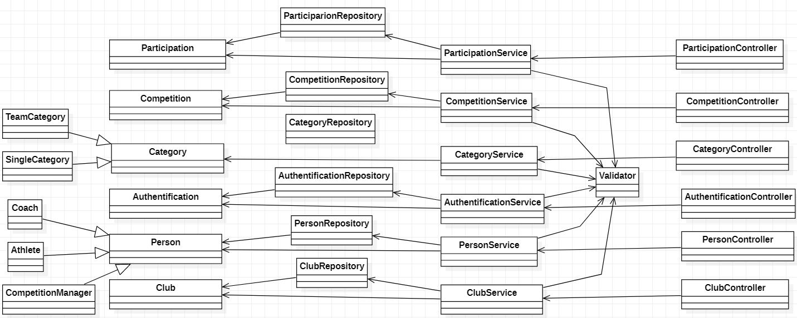
### **Diagrama de pachete**
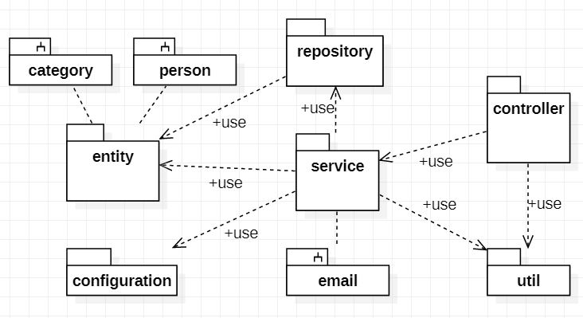
## Design-ul interfeței utilizator
(se va dezvolta ulterior)
### Design patterns: 
### 1)Observer
Folosit pentru a anunța antrenorii despre noi competiții adăugate. Notificarea antrenorilor se realizeaza printr-un mail trimis catre fiecare antrenor.
Clasa SendMail implementeaza interfata Observer si contine o metoda pentru trimiterea email-ului. Clasa NotificationCentre este clasa observata  si contine o lista de observatori(Observer). La apelul metodei "addNewCompetition", clasa NotificationCentre anunta observatorii aflati in lista sa de aparitia unei eveniment si astfel clasa SendMail va trimite email-uri catre antrenori.
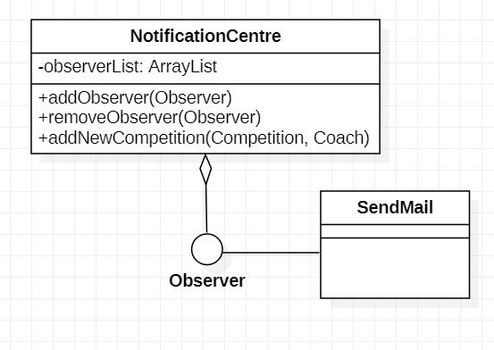
### 2)Facade
Folosit pentru a realiza conexiunea cu baza de date. Oferă o interfață simplificată a operațiilor asupra bazei de date.
### 3)Factory Method
Folosit pentru crearea persoanei si a categoriei pe baza tipului.  
#### Crearea unei categorii
Clasa CategoryService contine un atribut de tipul CategoryFactory si apeleaza metoda createCategory() pentru a crea o categorie(echipa sau individual).
Metoda createCategory() primeste tipul categoriei alaturi de valori pentru instantiere si returneaza un obiect de tip Category sau null in cazul in care nu s-a putut crea noua categorie.
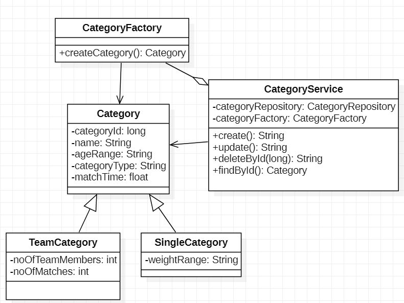
#### Crearea unei persoane
Clasa PersonService contine un atribut de tipul PersonFactory si apeleaza metoda createPerson() pentru a crea o noua persoana confor cu un tip specificat(manager de competitii, antrenor sau sportiv)
Metoda createPerson() primeste tipul persoanei alaturi de valori pentru instantiere si returneaza un obiect de tip Person sau null in cazul in care nu s-a putut crea noua persoana.
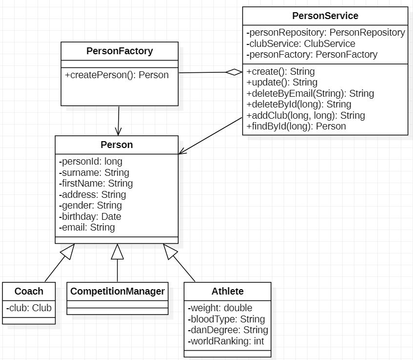
### Conexiunea la baza de date
#### *Diagrama relațională a bazei de date*
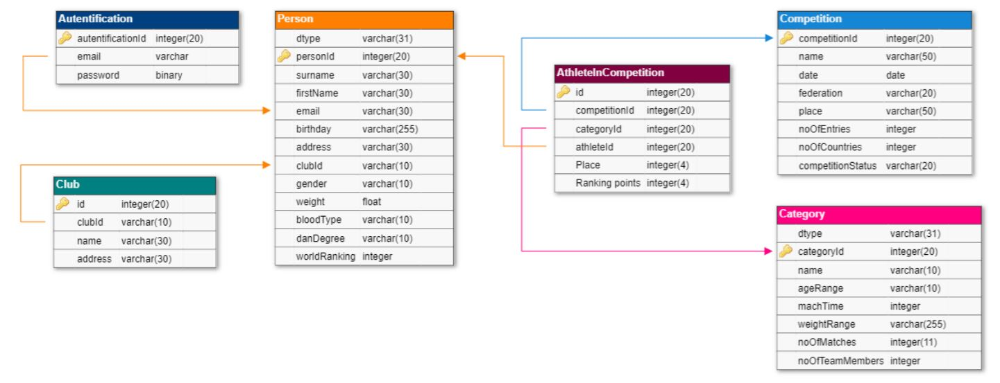
##### Diagrama detaliata a bazei de date
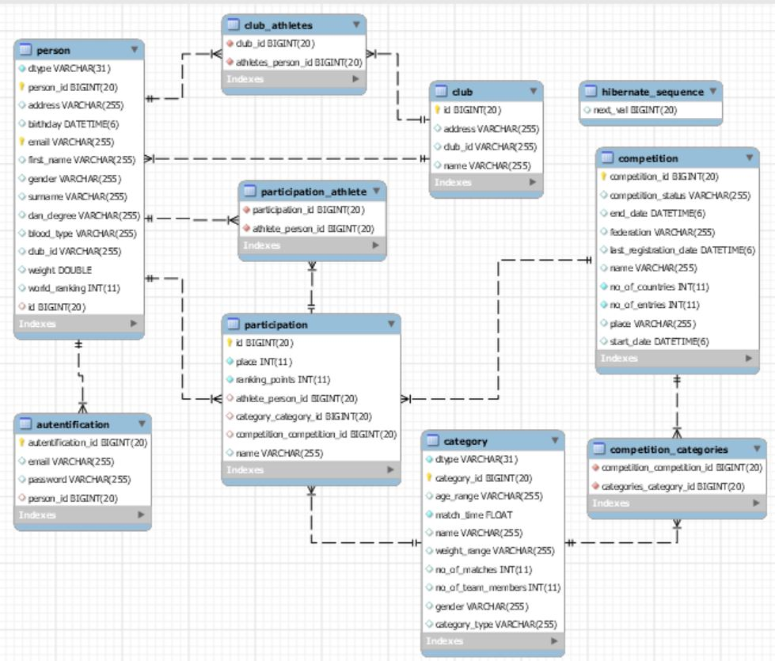
#### *Descrierea structurii bazei de date*
Baza de date este alcătuită din 6 tabele principale si tabele de legatura ce păstrează date despre utilizatori, sportivi, cluburi, competiții și categorii. Mai există și o tabelă de legătură ce 
## Testare și depanare
### Bug-uri întâmpinate
